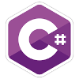
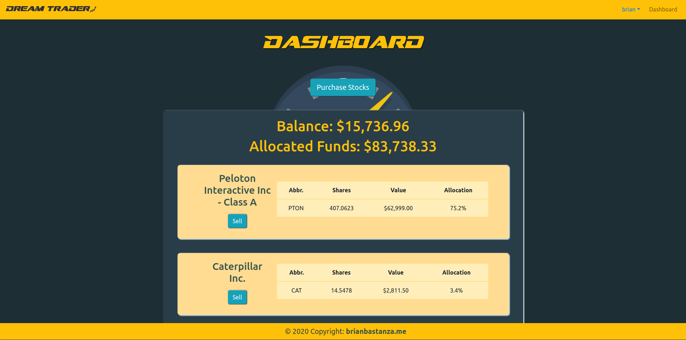
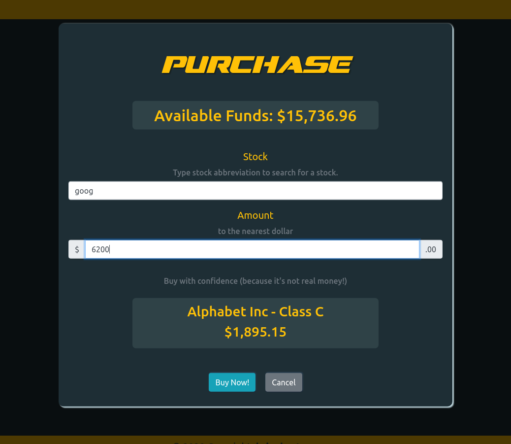
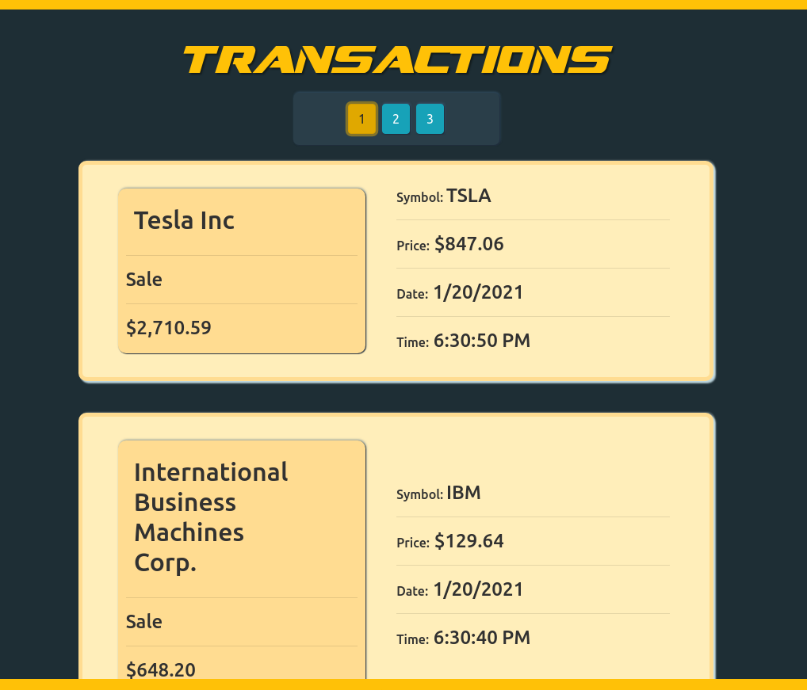

# Fantasy Stock Trader

> A full stack web app built in C# with ASP.Net Core, React JS and styled with Bootstrap4





Check out the app [HERE](https://dreamtrader.azurewebsites.net)!







## Summary

Dream Trader is a full stack web application utilizing a .Net Core Backend, React JS frontend and a PostgreSQL database. The
project uses stock data from the iexcloud.io api and makes user transactions based on real stock data and user input. The purpose 
of building this application was to learn to make a complex web application using a database and to dive deeper
into ASP.NET, while continuing to polish my React JS skills. I used the object relational mapper Fluent NHibernate 
along with diving deep into unit and integration testing with NUnit. These were both a first for me, and I am very proud 
to have completed an application of this scale. This was a very challenging project for me in many ways. Repetition of completing
another full stack web application with C# and React has been extremely valuable to competence and deeper understanding.

I grew in the following areas during this project:

> Setting up a PostgreSQL Database.

> Maintaining a database with multiple tables working together.

> Learning about how NHibernate works including: mappings, session factorys, ISessions and ITransactions.

> How to create and utilize my own middleware for global exception handling and database connections.

> How to implement logic to manipulate a users transactions using real time stock data. 

> Write unit and integration tests using NUnit testing library and Moq mocking library.

> Learning how to handle user login and registration.

> Write code to maintain a user session and authenticate using a combination of local storage, database tables and backend logic.

> Deployment to Microsoft Azure and Database on ElephantSQL.

## Installation

You will need keys from IexCloud to run this application locally. You can get one [here](https://www.iexcloud.io)

You will also need to set up a PostgreSQL database locally. The easiest way to do this is to use pgAdmin and
to restore the backup file I have created. You can find the backup at /Layout/stock_db. 

You must to add a file called `appsettings.Development.json` in the `API/` directory. The contents of the file should be the following:

```
{
    "Logging": {
        "LogLevel": {
            "Default": "Information",
            "Microsoft": "Warning",
            "Microsoft.Hosting.Lifetime": "Information"
        }
    },
    "IexKeys": {
        "SecretKey": <Insert Secret Key Here>,
        "PublicKey": <Insert Public Key Here>,
        "TestKey": <Insert Test Key Here>
    },
    "sessionFactory": {
      "Host": <Postgres Host>,
      "Username": <Postgres Username>,
      "Password": <Postgres Password>,
      "Database": <Postgres Database>,
      "Port": <Postgres Port>
    }
}
```
If you do not have npm on your system you will need to install it.

You can then go to the `API/Client/` directory and run

```$ npm i```

To run the application:

    Run IIS in the API project in Visual Studio or Jetbrains Rider

    or 

    Navigate to the `API/` folder and run:

```$ dotnet watch run```


## Author

### Brian Bastanza- Full Stack Web Developer

<a href="https://www.brianbastanza.me/" target="_blank" rel="noopener">Personal Website</a>

[LinkedIn](https://www.linkedin.com/in/bbastanza)
